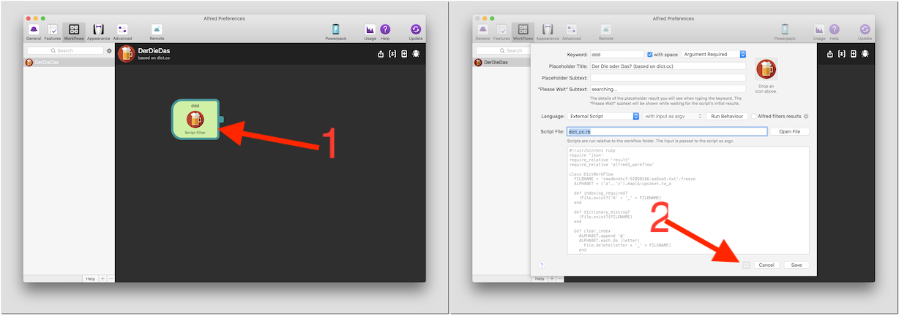
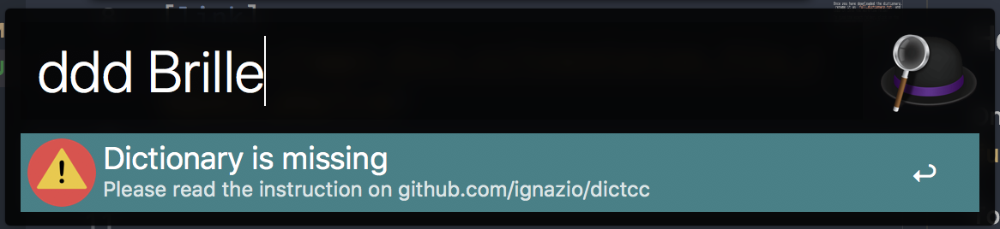
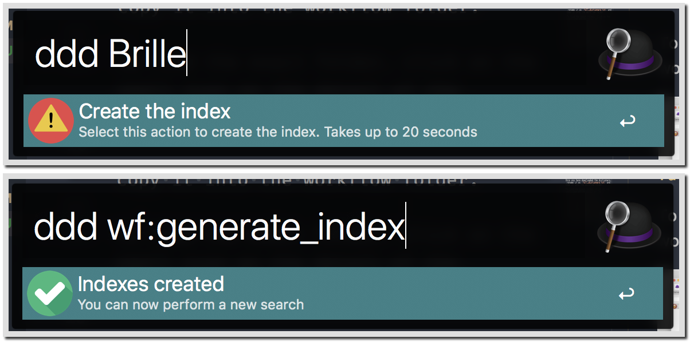
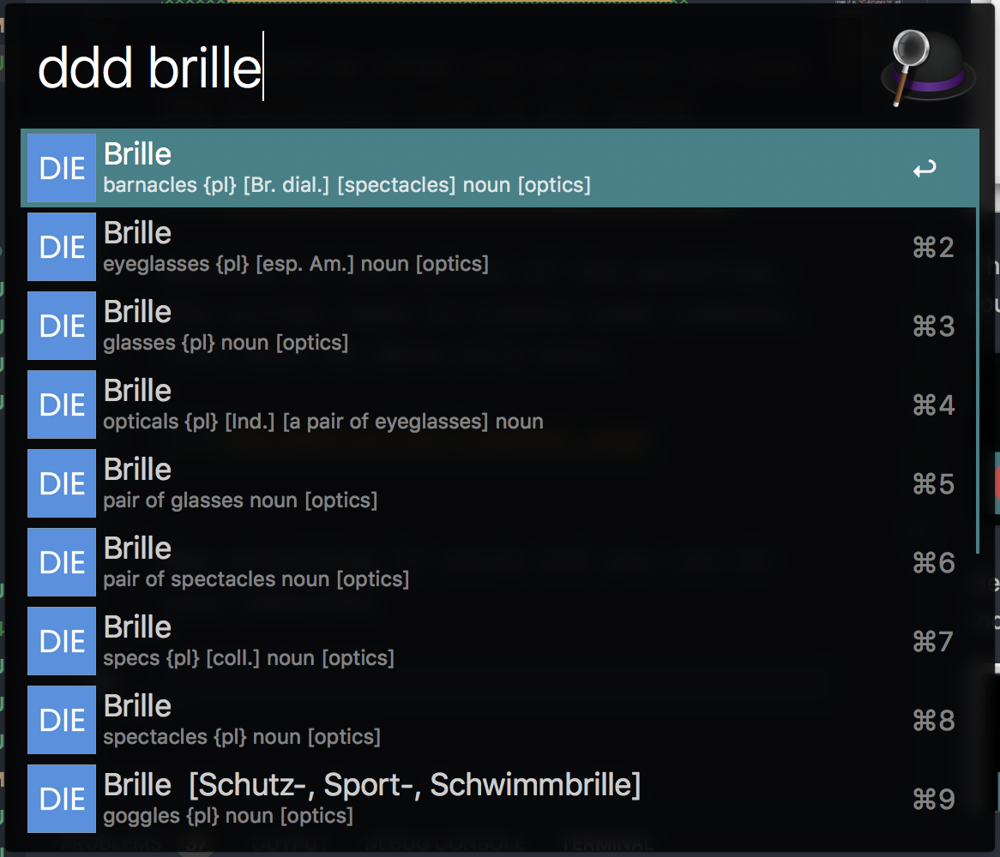

# DerDieDas

Alfred workflow for easily translate and get the gender of the german words

* Download the workflow from here: [https://github.com/ignazioc/DerDieDas/releases/tag/1.0](https://github.com/ignazioc/DerDieDas/releases/tag/1.0)
* Request your dictionary (DE->EN) for free from the dict.cc website: [https://www1.dict.cc/translation_file_request.php?l=e](https://www1.dict.cc/translation_file_request.php?l=e)

This workflow is based on the dict.cc dictionary.
Accordingly to the "Terms of Use" of dict.cc, this repository doesn't contain the dictionary data, but you can request it for free visiting this page:
[link](https://www1.dict.cc/translation_file_request.php?l=e)

## How to use

Once you have downloaded the dictionary, rename it as `full_dictionary.txt` and copy it into the workflow folder.

To find the exact folder, click on the small icon on the detail of the workflow.

The workflow shows you an error in case the dictionary file is not found.

Because of the nature of the workflow, the script need to create some indexes.
This must be done only once.

Now eveything is setup and you can do your searches

*Note:* 
Thanks to deanishe from the Alfred forum, who helped me understand the hidden mystery of NSTask and _unicode normalization_

Icons made by <a href="http://www.freepik.com" title="Freepik">Freepik</a> from <a href="https://www.flaticon.com/" title="Flaticon">www.flaticon.com</a> is licensed by <a href="http://creativecommons.org/licenses/by/3.0/" title="Creative Commons BY 3.0" target="_blank">CC 3.0 BY</a>

